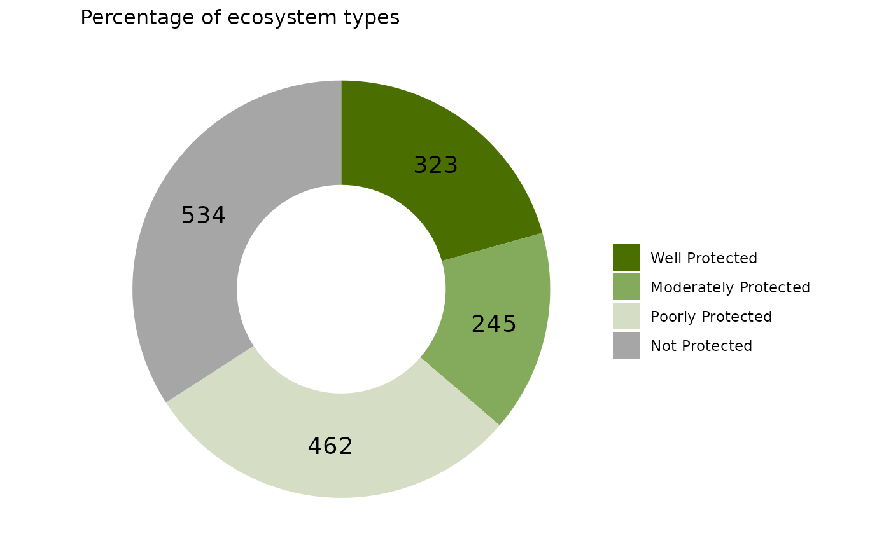
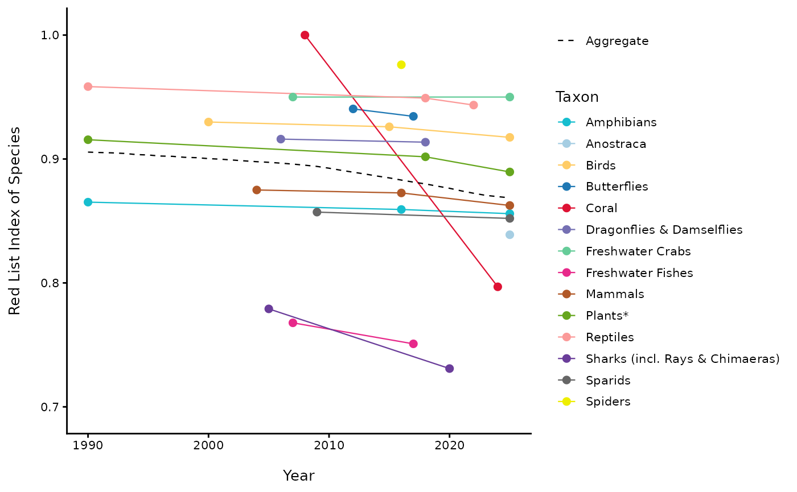
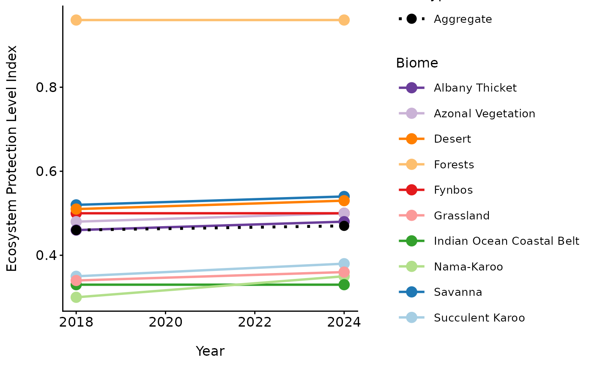
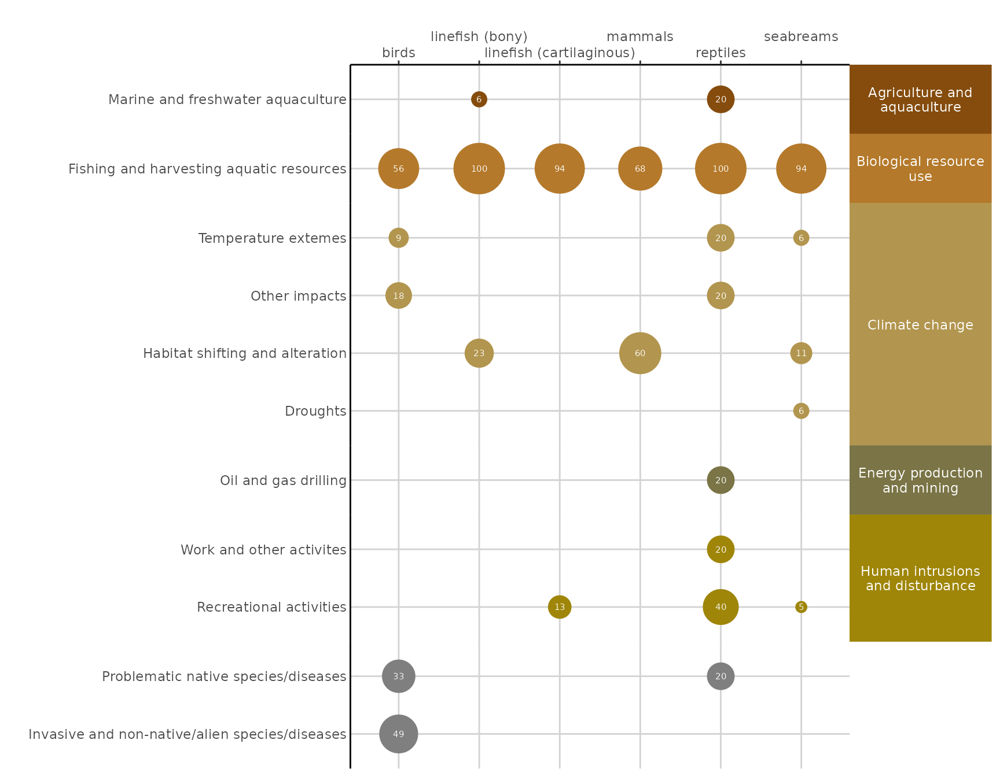
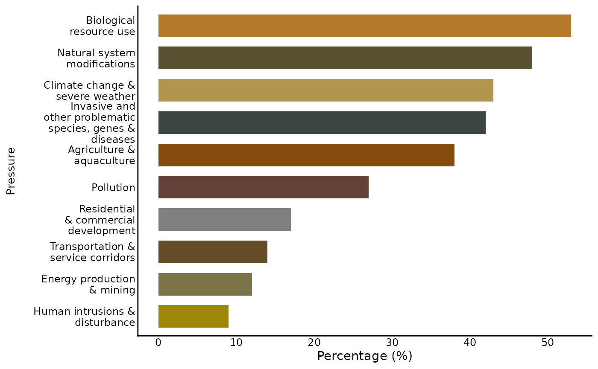

# nbaR

``` r
library(nbaR)
```

This Vignette is to help users become familiar with the NBA package and
get the most use out of its functions.

This package was create to help create the figures, plots, tables, and
maps for the NBA. The functions are split into those used to make plots,
those used to makes tables, and those used to make maps.

The plot functions consist of one main plot funcion called NBA_plot that
will create either a bar or donut plot and colour the graph by matching
the category words (such as endangered, well protected, natural etc)
with their set colours. There is then a complimentary function called
NBA_comp which is used if you want to plot two plots together using
gg_arrange as the underlying code, and NBA_theme that is a ggplot theme
with all the NBA presets that can be applied to any ggplot object to
ensure the graph maintains the NBA ‘look’.

The table functions consist of NBA_tbl which makes a basic table for a
quarto document outputting to an html, NBA_bl_colr which makes a basic
table with a purple heading bar and colours the category names by their
preset colours. There is also a complimentary NBA_tbl_theme function
that styles any gt table with the NBA’s preset styling.

The map functions currently only consist of one function NBA_map, made
using ggplot 2 and recreates the maps in the marine technical report
2018.

There are then five example datasets that can be accessed to test the
functions and see the required format of the data to use the functions,
which are: NBA_example_thr_data, NBA_example_pro_data,
NBA_example_comb_data, NBA_example_RLI_data, and NBA_example_map_data.
There is also a list of the category names (NBA_categories) that are
recognised by the function so that you can make sure you are using the
correct naming convention. The functions **are** case sensitive so you
must be careful when naming your categories.

## Plot functions

Load the example data and use the variouse functions to create NBA
plots.

**1. bar plot**

``` r
NBA_example_thr_data <- NBA_example_thr_data


bar_plot <- nba_plot(NBA_example_thr_data,
                  `OVERALL types`,
                  2:5,
                 CHRT = "bar",
                 NUM = TRUE,
                 LAB = "Percentage of ecosystem types",
                SAVE = NULL)

bar_plot
```


**2. donut plot**

``` r
NBA_example_pro_data <- NBA_example_pro_data


donut_plot <- nba_plot(NBA_example_pro_data,
                  `OVERALL types`,
                  2:5,
                 CHRT = "donut",
                 NUM = TRUE,
                 LAB = "Percentage of ecosystem types",
                 GRP = F,
                SAVE = NULL,
                IS_PERCENT = F)

donut_plot
```



**3. Combined plot**

``` r
NBA_example_pro_data <- NBA_example_pro_data
NBA_example_thr_data <- NBA_example_thr_data
NBA_example_comb_data <- NBA_example_comb_data


bar_plot_comb <- nba_plot_comb(
               NBA_example_comb_data,
                GROUPS= `OVERALL types`,
                METRIC_COL = metric,
               METRICS = c("protection_level", "threat_status"),
                COLS = 3:10,
                CHRT = "bar",
                NUM = FALSE,
               LAB = "Percentage of ecosystem",
                SAVE=NULL)

bar_plot_comb
```


**4. Index plot**

``` r
NBA_example_rlis_data <- NBA_example_rlis_data 
NBA_example_rlie_data <- NBA_example_rlie_data
NBA_example_epli2018_data <- NBA_example_epli2018_data
NBA_example_epli2024_data <- NBA_example_epli2024_data

 
# RLIs grouped by Taxon
nba_index_plot(
    TYPE = "RLIs",
    DF = NBA_example_rlis_data,
    YEAR = Year,
    RLI = RLI,
    ASSESSMENT_YEAR = Assessment_Year,
    GROUP = Taxon,
    PALETTE = "taxon",
    AGGREGATE = TRUE,
    SAVE = NULL
  )
```



``` r
 
# RLIe
nba_index_plot(
    TYPE = "RLIe",
    DF = NBA_example_rlie_data,
    YEAR = "Year",
    RLIE = "RLIE",
    BIOME = "Biome",
    PALETTE = "biome",
    SAVE = NULL
  )
```


``` r
 
# EPLI
nba_index_plot(
    TYPE = "EPLI",
    EPLI_list = list(
      "2018" = NBA_example_epli2018_data,
      "2024" = NBA_example_epli2024_data
   ),
   PALETTE = "biome",
   SAVE = NULL
 )
```



**5. NBA bubble plot**

``` r
NBA_example_bubble_data <- NBA_example_bubble_data


 bubble_plot <- nba_plot_bubble(DF = NBA_example_bubble_data,
                        GROUP = taxon_group,
                       CAT = pressure,
                       SUB_CAT = sub_pressure,
                        VALUE = perc_concern_under_press,
                          SAVE = NULL)
                         
 bubble_plot
```



**6. NBA pressure bar plot**

``` r
NBA_example_press_bar_data <- NBA_example_press_bar_data


birds_press_bar_plot <- nba_pressure_bar_plot(
                           DF = NBA_example_press_bar_data,
                           TAXON = "Birds")

birds_press_bar_plot
```



**7. NBA ggplot theme**

``` r
library(ggplot2)
NBA_example_pro_data <- NBA_example_pro_data


gg_plot <- ggplot(NBA_example_pro_data, aes(x = `OVERALL types`, y = `Well Protected`))+
  ggplot2::geom_point()+
  nba_plot_theme()

gg_plot
```


## Table functions

Please note that these are designed to render on html outputs and so may
not appear correct in the vignette examples.

**8. Basic table**

``` r

tbl <- nba_tbl(NBA_example_pro_data)

tbl
```

|                |                |                      |                  |               |
|:---------------|---------------:|---------------------:|-----------------:|--------------:|
| OVERALL types  | Well Protected | Moderately Protected | Poorly Protected | Not Protected |
| subAntarctic   |             15 |                   14 |                1 |             4 |
| Coastal        |             65 |                   28 |               52 |            41 |
| Estuarine      |              4 |                    8 |                7 |             3 |
| Marine         |             47 |                   62 |               22 |            19 |
| Wetland        |              8 |                    4 |               41 |            82 |
| River          |             29 |                   33 |               66 |            94 |
| Inland Aquatic |             37 |                   37 |              107 |           176 |
| Terrestrial    |            118 |                   59 |              166 |           115 |

**9. Coloured table**

``` r

library(dplyr)
#> 
#> Attaching package: 'dplyr'
#> The following objects are masked from 'package:stats':
#> 
#>     filter, lag
#> The following objects are masked from 'package:base':
#> 
#>     intersect, setdiff, setequal, union
library(tidyr)

tbl <- NBA_example_pro_data %>%
 pivot_longer(2:5, names_to = "protection_level") %>%
 nba_tbl_colr(COL = protection_level, HEADER = "Coast")

tbl
```

| OVERALL types  |   protection_level   | value |
|:---------------|:--------------------:|:-----:|
| subAntarctic   |    Well Protected    |  15   |
| subAntarctic   | Moderately Protected |  14   |
| subAntarctic   |   Poorly Protected   |   1   |
| subAntarctic   |    Not Protected     |   4   |
| Coastal        |    Well Protected    |  65   |
| Coastal        | Moderately Protected |  28   |
| Coastal        |   Poorly Protected   |  52   |
| Coastal        |    Not Protected     |  41   |
| Estuarine      |    Well Protected    |   4   |
| Estuarine      | Moderately Protected |   8   |
| Estuarine      |   Poorly Protected   |   7   |
| Estuarine      |    Not Protected     |   3   |
| Marine         |    Well Protected    |  47   |
| Marine         | Moderately Protected |  62   |
| Marine         |   Poorly Protected   |  22   |
| Marine         |    Not Protected     |  19   |
| Wetland        |    Well Protected    |   8   |
| Wetland        | Moderately Protected |   4   |
| Wetland        |   Poorly Protected   |  41   |
| Wetland        |    Not Protected     |  82   |
| River          |    Well Protected    |  29   |
| River          | Moderately Protected |  33   |
| River          |   Poorly Protected   |  66   |
| River          |    Not Protected     |  94   |
| Inland Aquatic |    Well Protected    |  37   |
| Inland Aquatic | Moderately Protected |  37   |
| Inland Aquatic |   Poorly Protected   |  107  |
| Inland Aquatic |    Not Protected     |  176  |
| Terrestrial    |    Well Protected    |  118  |
| Terrestrial    | Moderately Protected |  59   |
| Terrestrial    |   Poorly Protected   |  166  |
| Terrestrial    |    Not Protected     |  115  |

**10. gt table theme**

``` r
library(gt)
library(dplyr)


gt_tbl <- NBA_example_thr_data %>% 
  gt() %>% 
  nba_tbl_theme()

gt_tbl
```

| OVERALL types  | Critically Endangered | Endangered | Vulnerable | Least Concern | TOT |
|:---------------|:---------------------:|:----------:|:----------:|:-------------:|:---:|
| Sub-Antarctic  |           0           |     1      |     5      |      28       | 34  |
| Coastal        |          21           |     37     |     54     |      74       | 186 |
| Estuarine      |           2           |     10     |     7      |       3       | 22  |
| Marine         |           2           |     22     |     51     |      75       | 150 |
| Wetland        |          83           |     12     |     12     |      28       | 135 |
| River          |          95           |     42     |     5      |      80       | 222 |
| Inland Aquatic |          178          |     54     |     17     |      108      | 357 |
| Terrestrial    |          35           |     39     |     29     |      355      | 458 |

**11. Threatened ecosystems protection level table**

``` r
thr_pro_tbl <- NBA_example_map_data |>
nba_tbl_comb(GROUP = P_EcosysType,
THR = threat_status,
PRO = protection_level, 
FILE = "spatial")

thr_pro_tbl
```

|                       | Not Protected | Poorly Protected | Moderately Protected | Well Protected | Total |
|:----------------------|:-------------:|:----------------:|:--------------------:|:--------------:|:-----:|
| Critically Endangered |       0       |        1         |          1           |       1        |   3   |
| Endangered            |       0       |        1         |          0           |       1        |   2   |
| Vulnerable            |       1       |        0         |          1           |       1        |   3   |
| Near Threatened       |       0       |        0         |          1           |       1        |   2   |
| Least Concern         |       0       |        1         |          1           |       1        |   3   |
| Total (n)             |       1       |        3         |          4           |       5        |  13   |

## Map functions

**12. Basic map**

Please note this was modeled after the maps in the marine technical
report 2018.

``` r

map <- nba_map(DF = NBA_example_map_data,
               GEOM = "vector", 
               FILL = protection_level, 
               LEGEND = TRUE, 
               MOE = TRUE)

map
```


